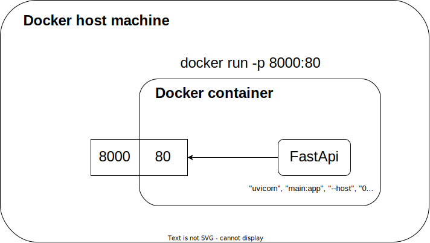

# Docker container lifecircle

Cuando ejecutamos un contenedor de nuestra imagen lo hacemos asi:

`docker run <image_name>`

`docker run hello_world`

podemos ver la salida `Hello Truedat`

pero donde esta ese contenedor? que ha pasado con el ha desaparecido esta parado sigue ejecutandose?

podemos ver nuestros contenedores con el siguiente comando:

`docker container ls -a` o la version antigua `docker ps -a`


```
CONTAINER ID   IMAGE         COMMAND                  CREATED              STATUS                     PORTS     NAMES
d343339c4600   hello_world   "python hello_world.…"   About a minute ago   Exited (0) 6 seconds ago             hello_world_container
```

ahi vemos nuestro contenedor vemos que tiene un status y su valor es exited por que es esto? veamos otro ejemplo

vamos a ejecutar un contenedor que lo que va a hacer es dormir para siempre

`docker run <image> <command>`

`docker run ubuntu sleep infinity`

`docker run -d ubuntu sleep infinity`

si miramos los contenedores vemos que tienen un status distinto estan running

`docker container ls -a` 

```
CONTAINER ID   IMAGE     COMMAND            CREATED          STATUS          PORTS     NAMES
71a1ca8edfde   ubuntu    "sleep infinity"   4 seconds ago    Up 4 seconds              sharp_benz
81a8045e6c98   ubuntu    "sleep infinity"   36 seconds ago   Up 35 seconds             festive_mcnult
```

Por lo general un 

# Image layers
## How does docker build images
docker build . -t scratch-hello-world
Sending build context to Docker daemon  2.048kB
Step 1/2 : FROM scratch
 ---> 
Step 2/2 : RUN cat "Hello Truedat" > hello_truedat.txt
 ---> Running in 3bd10cda6869
failed to create shim task: OCI runtime create failed: runc create failed: unable to start container process: exec: "/bin/sh": stat /bin/sh: no such file or directory: unknown
## Docker history
## Pre question about which dockerfile is better
fast-api




## Practical example
## Docker context

Cuando hacemos docker build solemos hacer algo por el estilo

`docker build . -t <image-name>`

pero que es ese punto? puede ser donde se situe el archivo Dockerfile? probemos a especificar el Dockefile

Con este comando podemos especificar el path del archivo Dockerfile
`docker build -f Dockerfile . -t test`

de tal forma si movemos el Dockerfile por ejemplo dentro de una carpeta **docker_file**

`docker build -f docker_file/Dockerfile . -t test`

parece que funciona entonces que es ese punto? es el path local pero para que usa eso docker entonces? probemos a cambiarlo tambien por la carpeta

`docker build -f docker_file/Dockerfile docker_file -t test`

```
Step 1/2 : FROM scratch
 ---> 
Step 2/2 : COPY hello_truedat.txt hello_truedat.txt
COPY failed: file not found in build context or excluded by .dockerignore: stat hello_truedat.txt: file does not exist
```

Que es el build context?

Asi lo define Docker

A build’s context is the set of files located in the specified PATH or URL. The build process can refer to any of the files in the context. For example, your build can use a COPY instruction to reference a file in the context.

es por ello que cuando hacemos nuestro copy de hello_truedat.txt no ponemos ningun path ya que esta en la raiz del build context

Como puede afectar el build context en la velocidad de creacion de las imagenes

si generamos un archivo grande de un GB

`openssl rand -out sample.txt -base64 $(( 2**30 * 3/4 ))`

y volvemos construir nuestra imagen

`docker build -f Dockerfile . -t test`

vemos como ahora tarda mucho mas, el motivo es que el contexto es mucho mayor

`Sending build context to Docker daemon  1.091GB`

Como podemos evitar esto? creando un archivo `.dockerignore` en el cual especificaremos que cosas no necesitamos en el build context

# Registry, Repository, Image name, Tags # TODO


1. REPASO

    ver los archivos que teniamos ejecutarlos etc

2. Explicar mejor el Dockerfile

    Dockerfile.md explicacion de todos los comandos

3. Explicar los contenedores algo mejor

    Docker container lifecircle

4. Pasar a una aplicacion algo mas compleja como FastApi

    4.1. Crear una app simple de Fastapi

    4.2. Crear una imagen docker para esta app

    4.3. Ejecutar un contenedor con la imagen

    4.4. Cambiar algo del codigo y ver lo rapido que se construye

    4.5. Cambiar el orden del run pip install y el copy

5. Image layers 

    5.1. Build from zero and check FastApi layers docker build

    5.2. Check intermediate images `docker image ls -a`
    
    5.3. Check Dockerfile and build again
    
    5.4. Check intermediate images `docker image ls -a`
    
        Now there is only one layer more

    5.5. `docker history <image>`

6. Docker-compose

7. Image naming registry, repository, image name, tag

    **Repository** Un repositorio es donde guardamos una imagen y todas sus versiones/tags

    **Registry**  A collection of repositories. ECR Elastic Container **Registry**

8. Push to Dockerhub and Gitlab

    8.1. Gitlab


        `docker login registry.gitlab.com`

        `docker build -t registry.gitlab.com/anton945939/docker .`

        `docker push registry.gitlab.com/anton945939/docker`
## exec
### exec -it bash